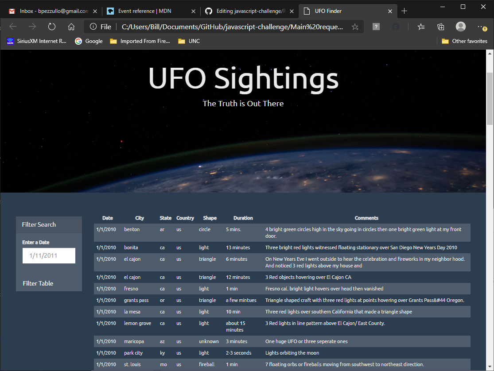
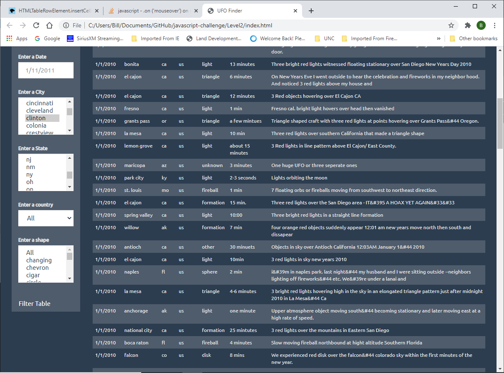

# JavaScript Homework - JavaScript and DOM Manipulation

## Assignment

There are 2 directories in the repository.  The first one covers the main request to filter by date.  The below picture shows what it would look like.  Open the index.html file under the directory to see the application.  Enter a date and hit the filter button to filter down the data.  If you enter an invalid date an alert message will pop up.

The second directory is called Level2 and includes the request to filter on all the fields.  That was provided and some of the fields City, state and shape are 
multi-selection capable.  Below is a screenshot of the webpage look.  Opend the index.html file from the Level2 directory to see the application.  Enter a date or any other input to filter down the data.  The city, state and shape are multi select fields.

## Background

WAKE UP SHEEPLE! The extra-terrestrial menace has come to Earth and we here at `ALIENS-R-REAL` have collected all of the eye-witness reports we could to prove it! All we need to do now is put this information online for the world to see and then the matter will finally be put to rest.

There is just one tiny problem though... our collection is too large to search through manually. Even our most dedicated followers are complaining that they are having trouble locating specific reports in this mess.

That's why we are hiring you. We need you to write code that will create a table dynamically based upon a [dataset we provide](StarterCode/static/js/data.js). We also need to allow our users to filter the table data for specific values. There's a catch though... we only use pure JavaScript, HTML, and CSS, and D3.js on our web pages. They are the only coding languages which can be trusted.

You can handle this... right? The planet Earth needs to know what we have found!

## Your Task

### Level 1: Automatic Table and Date Search (Required)

* Create a basic HTML web page or use the [index.html](StarterCode/index.html) file provided (we recommend building your own custom page!).

* Using the UFO dataset provided in the form of an array of JavaScript objects, write code that appends a table to your web page and then adds new rows of data for each UFO sighting.

  * Make sure you have a column for `date/time`, `city`, `state`, `country`, `shape`, and `comment` at the very least.

* Use a date form in your HTML document and write JavaScript code that will listen for events and search through the `date/time` column to find rows that match user input.

### Level 2: Multiple Search Categories (Optional)

* Complete all of Level 1 criteria.

* Using multiple `input` tags and/or select dropdowns, write JavaScript code so the user can to set multiple filters and search for UFO sightings using the following criteria based on the table columns:

  1. `date/time`
  2. `city`
  3. `state`
  4. `country`
  5. `shape`

- - -

### Dataset

* [UFO Sightings Data](StarterCode/static/js/data.js)

- - -

**Good luck!**

- - -

### Copyright

Trilogy Education Services © 2019. All Rights Reserved.
